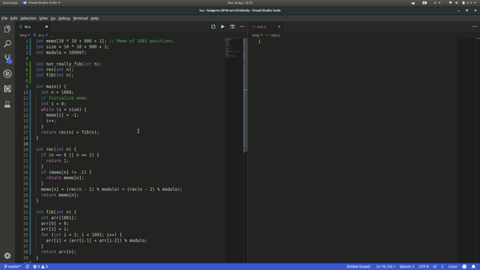

# langproc-2018-cw-LittleItaly
The project consists of:

- C to MIPS1 compiler (subset of C).
- C to Python translator (subset of C).
- Testbench for compiler and translator.
- Time management report.

## Folders structure
- `bin`: contains binaries.
- `c_compiler`: contains files specific to the C compiler.
- `c_translator`: contains files specific to the C translator.
- `common`: contains files that are shared by both the compiler and the translator.
- `management`: contains files for time management.
- `test_deliverable`: contains files for the assessed tests.
- `compiler_testbench`: test suite for the compiler.
- `translator_testbench`: test suite for the translator.

## Lexing, parsing and AST
Both the C compiler and the C translator share the same lexer, parser and Abstract Sintax Tree structure. 
The code is contained in the `common` folder. Lexer and parser are implemented with Flex and Bison (open source equivalents of Lex and Yacc). 
The classes that represent the nodes of the Abstract Syntax Tree are contained in the `common/inc/ast` folder.

## C to MIPS1 compiler
### Features
The compiler supports a subset of the C language. 
The main supported features are:

- local and global variables of `int` type.
- local and global pointers (to `int`s).
- local and global arrays of integers (e.g. `int arr[10];`).
- nested scopes for variables.
- all arithmetic and logical expressions.
- if-else statements.
- while loops.
- for loops.
- switch statements.
- `break` and `continue` keywords.
- enum declarations.
- get the address of a variable with the `&` operator.
- dereference a pointer with the `*` operator.
- functions that take up to 4 parameters.
- recursive and mutually recursive function calls.
- special support for main.
- allow function definition and implementation in different files.

### Limitations
This compiler has been developed by a team of two people, in around one month alongside other university lectures and assignments, hence there are some limitations. The main ones are:

- no support for types different from `int`.
- the assembly code is generated directly from the AST, so it would have been difficult to implement optimizations like Live Variable Analysis, Common Subexpression Elimination and Contstant Propagation.
- the C code has to be already [preprocessed](https://en.wikipedia.org/wiki/C_preprocessor).

### Usage
The tool is really easy to use. 

- clone the repository on your local machine and move to the root of the repository.
- build the compiler with `make bin/c_compiler`.
- run it with `bin/c_compiler -S path_to_test_program.c -o path_to_generated_asm.s`. Now you can look at the generated MIPS assembly.

Example: 

If you want to proceed further and run your code, you need to:
- assmeble the assmebly program using a GCC tool for MIPS: `mips-linux-gnu-gcc -mfp32 -o path_to_executable -c path_to_generated_asm.s`
- run the executable using a MIPS CPU simulator. You can either use qemu `qemu-mips path_to_executable` or use the [simulator I implemented](https://github.com/MarcoSelvatici/ICL-courseworks/tree/master/2nd_year/MIPS)!

Alternatively, you can run the testbench that will do all these steps and run several sample testcases: `./compiler_testbench/test_suite.sh`.

## C to Python translator
### Features
- Global and Local `int` variables.
- Functions with 0 or more integer parameters.
- if-else statements.
- while statements.
- return statements.
- arithmetic and logical operations. 

### Usage
As before:

- clone the repository on your local machine and move to the root of the repository.
- build the compiler with `make bin/c_compiler`.
- run it with `bin/c_compiler --translate path_to_test_program.c -o path_to_generated_py.py`. Now you can look at the generated Python code.
- Run the Python code the way you prefer.

Alternatively, you can run the testbench that will do all these steps and run several sample testcases: `./translator_testbench/test_translator.sh`.
